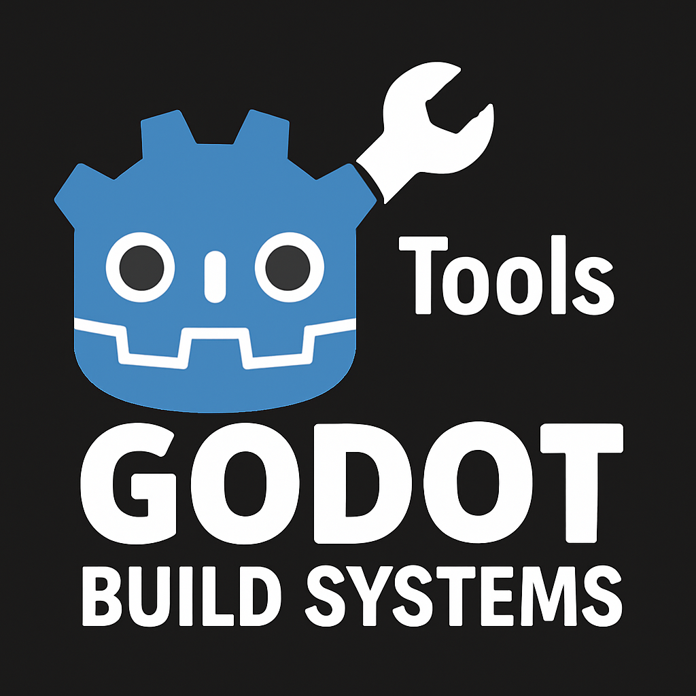

<div align="center">
    <picture>
        
    </picture>
</div>

## Purpose
This Godot Add-on makes exporting your game easier by providing necessary features into your export pipeline.

### Features
#### **Asset Bundling**
Simplifies the process of bundling assets without the need for complex scripts or manual work. Simply the user will place files within the designated bundle directory under the `bundles` directory.
#### **Predictive Resource Loading**
> [!NOTE]
> Work in progress, not fully implemented yet.

This feature allows you to load resources in advance, that may cause initial load lag spikes while in-game play. Example, particles, large textures, shaders, etc.
#### **GDScript Export Execution**
> [!NOTE]
> Work in progress, not fully implemented yet.

This feature allows you to run GDScript code during the export process. This is useful for tasks such as modifying files, creating directories, or performing other actions that need to be done before the export is complete.


### Installation
<details>
<summary>Click to expand (Installation by Cloning)</summary>

1. Clone the repository into your Godot project directory under `addons/godot-build-systems`.
2. Enable the add-on in the Godot editor by going to `Project` → `Project Settings` → `Plugins` and enabling the `godot-build-systems` plugin.
3. Configure the add-on settings in `Project` → `Project Settings` → `GDBuildSystem`.
4. Use the add-on features as needed in your project.

</details>
<details>
<summary>Click to expand (Installation by Downloading)</summary>

1. Download the latest release either from the [GitHub Releases](https://github.com/GDBuildSystem/GDBuildSystem/releases) page or from the [Godot Asset Library](https://godotengine.org/asset-library/asset/).
2. Extract the downloaded archive into your Godot project directory under `addons/godot-build-systems`.
3. Enable the add-on in the Godot editor by going to `Project` → `Project Settings` → `Plugins` and enabling the `godot-build-systems` plugin.
4. Configure the add-on settings in `Project` → `Project Settings` → `GDBuildSystem`.
5. Use the add-on features as needed in your project.

</details>

### Usage
<details>
<summary>Click to expand</summary>

1. First, we need to create the bundle directory, `res://bundles`. This is where we will place our bundle directories. This can be configured in the `Project` → `Project Settings` → `Build System` settings.
2. Then, we can create a bundle directory, `res://bundles/my_bundle`. This is where we will place our assets that we want to bundle.
> This will setup the project to use the build system to bundle the assets. These assets will be bundled into the `res://bundles/my_bundle` directory and not be included in the export of the main export. 

> A small unnecessary recommendation is to embed your resources into the executable. This will hide a extra PCK file from the user. This can be done in the `Project` → `Project Settings` → `Export` settings.

3. Now we need to actually load the bundles, initialize the BundleLoader into your initial scene via adding the `BundleLoader` node to your scene tree. This will load the bundles into memory and allow you to use them in your game.
> Keep in mind, the BundleLoader will only load the bundles that are in the `res://bundles` directory.

> Additionally, loading bundles is a synchronous/blocking process. This means that the game will freeze until the bundles are loaded. So it is ideal to load the bundles at the initial state of the game.

> Lastly, the BundleLoader has some exported properties that can be configured in the editor. Example, you can set to disable the autoloading of the bundles, if you want to do this via a script.

> [!NOTE]
> Moving forward, any assets placed outside the bundles, will be put into the main export.

</details>

### Bundle Best Practices
<details>
<summary>Click to expand</summary>

- **Bundles & Scripts**: Avoid placing scripts in bundles. Scripts should be placed in the main export directory to ensure they are always available. Bundles are primarily for assets like textures, audio, and other resources.

- **Bundle Directory Structure**: Organize your bundle directories in a way that makes sense for your project. For example, you might have separated directories for different segments of the game, such as `res://bundles/dlc`, `res://bundles/expansion`, or `res://bundles/level1`.
    
- **Bundle Naming**: Use descriptive names for your bundle directories to make it clear what assets they contain. For example, `res://bundles/textures` or `res://bundles/audio`.

- **Bundle Size**: Keep your bundle sizes reasonable. If you have a large number of assets, consider splitting them into multiple bundles to improve loading times.

- **Bundle Loading**: Load your bundles at the start of your game to ensure that all assets are available when needed. You can use the `BundleLoader` node to handle this.

</details>

### Roadmap
<details>
<summary>Click to expand</summary>

- [ ] Implement predictive resource loading.
- [ ] Implement GDScript export execution.
- [ ] Implement CLI Commands to only export the bundles. Ephmeral Bundle Exporting.

</details>

### Contributing
<details>
<summary>Click to expand</summary>

We welcome contributions to improve this project! Here's how you can contribute:

1. **Fork the Repository**  
    Fork this repository to your GitHub account.

2. **Clone the Repository**  
    Clone the forked repository to your local machine:
    ```bash
    git clone https://github.com/your-username/GDBuildSystem.git
    ```

3. **Create a Branch**  
    Create a new branch for your feature or bug fix:
    ```bash
    git checkout -b feature-or-bugfix-name
    ```

4. **Make Changes**  
    Implement your changes and commit them with clear and concise commit messages:
    ```bash
    git commit -m "Description of the changes made"
    ```

5. **Push Changes**  
    Push your changes to your forked repository:
    ```bash
    git push origin feature-or-bugfix-name
    ```

6. **Submit a Pull Request**  
    Open a pull request to the main repository. Provide a detailed description of your changes and why they should be merged.

### Guidelines
- Follow the existing code style and structure.
- Write clear and concise commit messages.
- Test your changes thoroughly before submitting.
- Ensure your changes do not break existing functionality.

Thank you for contributing!
</details>

### License
This project is licensed under the MIT License. See the [LICENSE](LICENSE) file for details.

### Acknowledgements

Thanks to the Godot community for their support and contributions. This project is built on the hard work of many developers and contributors in the open-source community.

### Contact

For any questions or feedback, please feel free to reach out to us via the GitHub Issues page or by creating a pull request.


### Support

If you find this project useful, consider supporting us by starring the repository or sharing it with others. Your support helps us continue to improve and maintain this project.